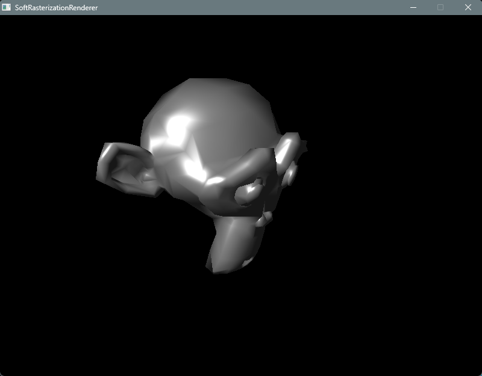

# SoftRasterizationRenderer

个人项目，从零构建的 C++ 软光栅渲染器，用于学习计算机图形学底层原理。不依赖 GPU，完全通过 CPU 实现 3D 渲染管线。

## 技术栈

- **语言**: C++17
- **图像**: SDL2 (窗口/帧缓冲显示), stb_image (纹理加载)
- **构建**: CMake (跨平台构建系统)

## 操作指南

| 按键          | 功能               |
| ----------- | ---------------- |
| **W/A/S/D** | 相机移动（前后左右）       |
| **Q/E**     | 相机上升/下降          |
| **鼠标移动**    | 控制视角（Yaw/Pitch）  |
| **鼠标滚轮**    | 调整 FOV（视野缩放）     |
| **ESC**     | 锁定/释放鼠标          |
| **T**       | 切换纹理显示（开/关）      |
| **C**       | 切换背面剔除（开/关）      |
| **L**       | 切换线框/填充模式        |
| **N**       | 切换法线可视化（调试用）     |
| **R**       | 打印渲染统计（剔除数/三角形数） |
| **P**       |  切换Shader  |

## 效果图

